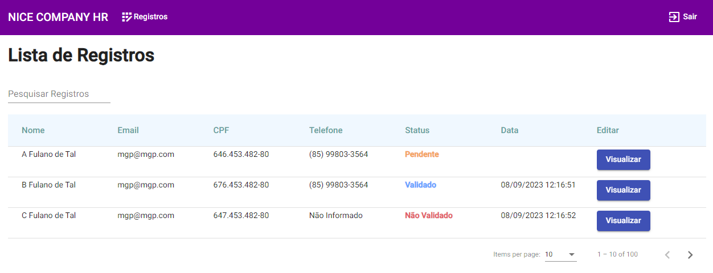

## Description

Fake Angular application for NICE COMPANY HR company.

## Setup

1 - Clone the repository,at branch DEVELOP.

```bash
$ git clone https://github.com/matheusmgp/nice-company-hr.git

$ git checkout develop
```

2 - Install the project dependencies

```bash
$ npm install
```

## Running the app

```bash
# watch mode
$ npm start
```

## Step by Step

1 - There is a fake login screen,just to separate admin environment from the employee environment
,don't worry about credentials,the login operation just set a varianle to localStorage,and reload the page to the list.

link:http://localhost:4200/login

<h1>

</h1>

2 - After fake login,this is the page where you'll find all registers from database.

link:http://localhost:4200/registros

<h1>

</h1>
3 - To see details click in 'Visualizar' button,then this is the page where you can validate or not a register.

link:http://localhost:4200/AdrianaAlmeida/validar/2

<h1>

</h1>

4 - Assuming that you are the admin,and there is a new employee,and you need to send him a link via email for example

link examples:
http://localhost:4200/employeeName/registrar
http://localhost:4200/randomName/registrar
http://localhost:4200/myName/registrar

after opening one of these links:

<h1>

</h1>

warnings

<h1>

</h1>

5 - After sending the form:

<h1>

</h1>
